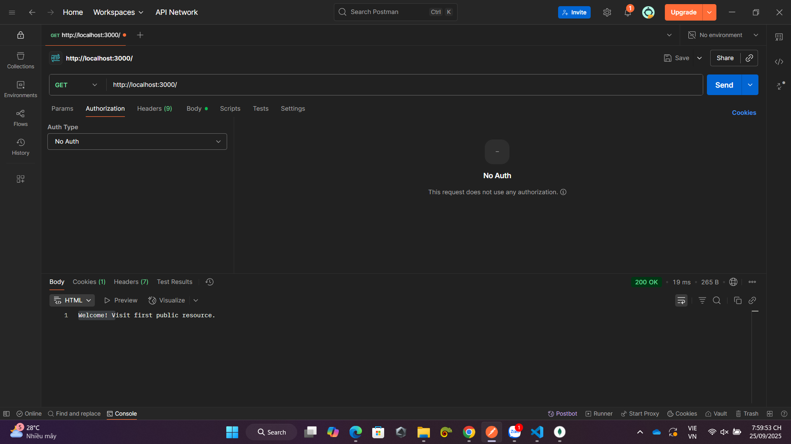

File Basic_auth.js

- Trước tiên tải express: npm install express
- chạy file basic_auth.js: node basic_auth.js
- Với route "/" và "/public" vẫn sẽ truy cập được mà không cần mật khẩu, kết quả hiển thị "Welcome! Visit first public resource."

- với route "/secure" nó sẽ yêu cầu gửi thêm Authentication username và password nếu không sẽ hiện thông báo "Authentication required." HTTP Status 401
- khi ta nhập username và password thì sẽ login thành công và thông báo "You have accessed a protected resource 🎉" HTTP Status 200
-khi ta nhập sai username hoặc password thì sẽ login thất bại và có thông báo "Access denied." HTTP Status 403

File Cookie_auth.js

- trước tiên tải mongoose, cookie-parser
- chạy file File Cookie_auth.js
- với phương thức POST Route "/login" chọn vào tab body, chọn raw và nhập
{
  "username": "admin",
  "password": "12345"

} 
- Kết quả trả về là "Logged in!"
- Postman lưu lại cookie

- Server gửi cookie auth_cookie_token về.

